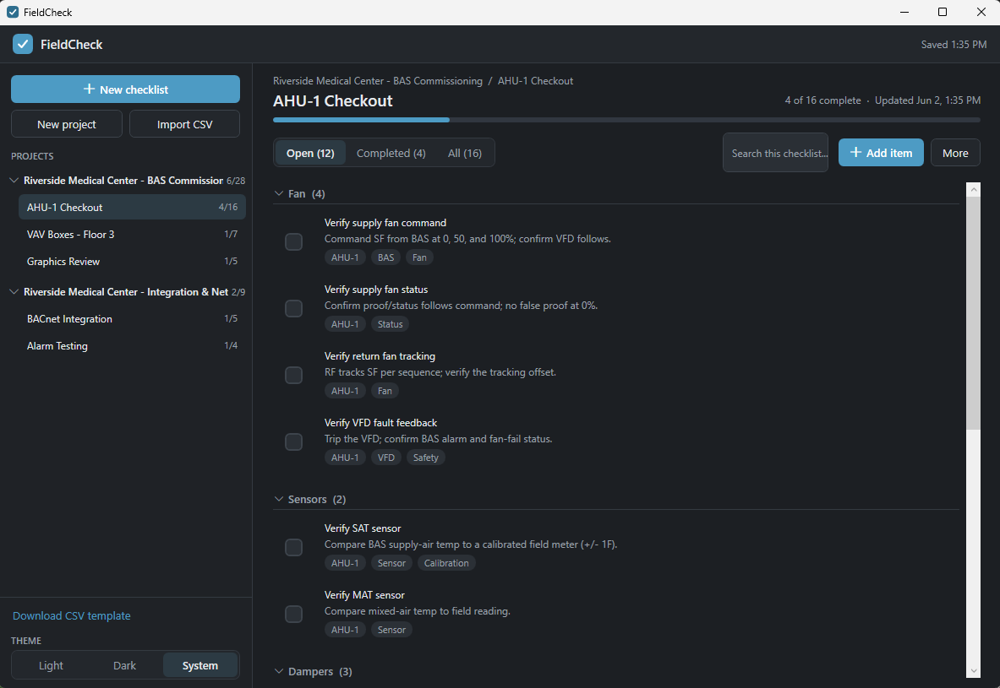
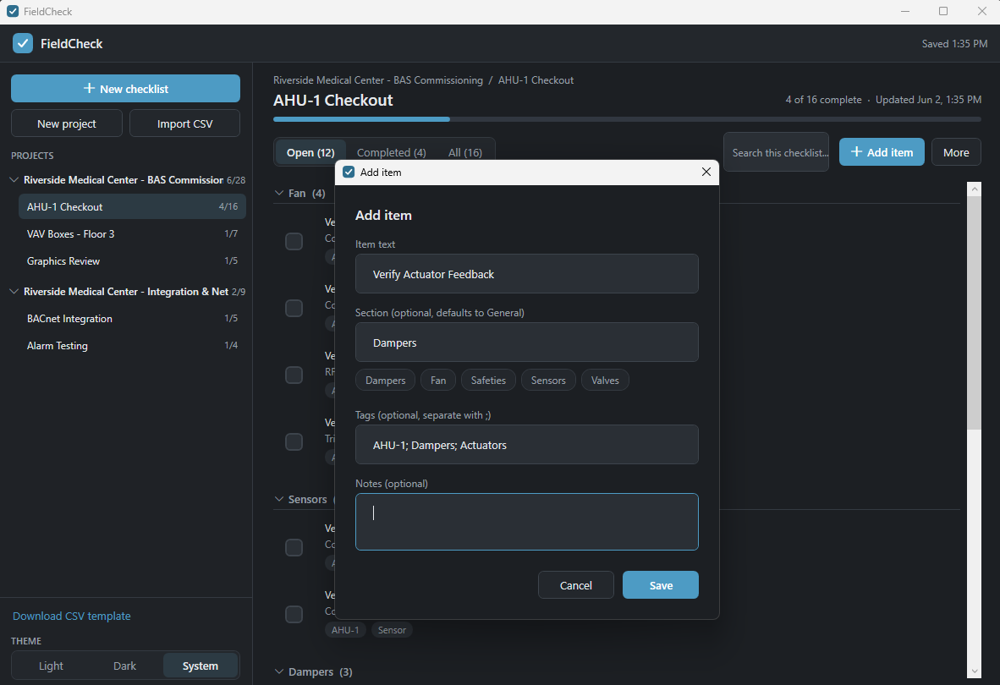
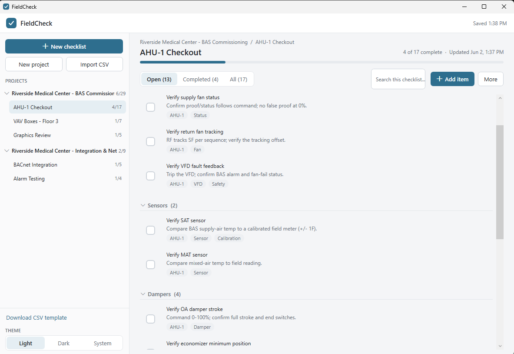

# FieldCheck

> A lightweight, self-contained Windows checklist app for commissioning, controls verification,
> and field punchlists. Projects → Checklists → Sections → Items → Tags. All data stays local —
> no install, no account, no cloud.




## Download

Download the latest **`FieldCheck.exe`** from the [Releases](../../releases) page and double-click
it — no installer, and no .NET runtime required. It is a single self-contained file; all your data
is stored locally as JSON in your user profile.

---

## Screenshots

| Add an item | Light theme |
| --- | --- |
|  |  |

Section-grouped items with tag pills; an add/edit dialog with section reuse-chips and
semicolon-separated tags; and light / dark / system themes.

---

## How it's organized

```
Project
  Checklist
    Section
      Item  (text, notes, tags)
```

- **Projects** are first-class containers (e.g. a job or building). The sidebar groups checklists
  under their project, and each group can be expanded/collapsed.
- A **Checklist** belongs to one project and holds items.
- Each **Item** belongs to one **Section** (a structural group — items are shown under section
  headers). A blank section shows as **General**.
- Each item can carry zero or more **Tags** — non-exclusive metadata pills (e.g. `AHU-1`, `BAS`).
  Sections organize; tags label.

## Features

- **Projects**: create, **select** (click a project row to open its Project Overview), rename (inline
  double-click, the overview's Rename button, or the row menu), delete (with confirmation),
  expand/collapse; create checklists inside a project.
- **Project Overview**: clicking a project opens a summary pane — overall progress with a bar and
  **Open / Issues / Complete / N/A** counts, the last-updated time, and a list of child checklists you
  can open. Actions: New checklist, Rename, Export project report, Delete.
- **Checklists**: create, rename inline, **duplicate with find/replace** (reuse AHU-1 → AHU-2),
  delete (with confirmation), reset; drag-and-drop reorder within a project; per-checklist progress badge.
- **Item statuses**: every item is **Open**, **Complete**, **Issue**, or **N/A**, set from a compact,
  theme-aware status pill on the row. Tabs are **Open · Issues · Complete · N/A · All**, each with a
  live count. Changing status never reorders an item.
- **Issue notes**: marking an item **Issue** reveals an inline note field to record what's wrong. The
  note autosaves and flows into Markdown reports, the workspace export, and search.
- **Sections**: items are grouped under section headers with counts; grouping works in every tab;
  sections can be collapsed; drag-and-drop reordering of items **within a section**.
- **Tags**: add/edit as a semicolon-separated list (`AHU-1; BAS; High Priority`); shown as subtle
  pills; whitespace trimmed, duplicates removed.
- **Filter items** (checklist toolbar) narrows the *current* checklist's visible items by text, notes,
  section, and tags, with a result count. Reordering is disabled while filtering so order can't be corrupted.
- **Search all** (header button or **Ctrl+K**) opens a command palette that searches across *every*
  project, checklist, section, item, and issue note; picking a result jumps you straight there.
- **Markdown reports**: export a clean report for a checklist (**Actions → Export checklist as
  Markdown**) or a whole project (**project menu → Export project report**) — grouped by status with
  notes and issue notes, ready to paste into email, Teams, or GitHub.
- **Export workspace** (sidebar **Export workspace…**) writes a timestamped folder containing the raw
  `data.json`, every checklist as CSV **and** Markdown, a per-project summary, the CSV template, and a
  README — a complete, portable copy of everything.
- **Autosave** after every meaningful change (debounced while typing), with a subtle "Saved 10:56 AM"
  status, safe/atomic writes, and an automatic backup.
- **Restore previous state** on reopen — last checklist, last tab, theme, expand/collapse, and window
  size/position.
- **Light / Dark / System theme** — an explicit three-button control in the sidebar (one click each,
  no hidden cycle); the choice is remembered.
- **CSV import / export**, **CSV template download**, and **print** (grouped by section, with tags).

---

## Running the published app

1. Get `FieldCheck.exe` (see *Publishing* below — output at `publish\win-x64\FieldCheck.exe`).
2. Double-click it. No .NET install is required.

Optionally right-click `FieldCheck.exe` → **Send to → Desktop (create shortcut)** for a desktop icon.

---

## Development

**Prerequisites:** [.NET SDK 8.0](https://dotnet.microsoft.com/download) on Windows.

```powershell
dotnet build                                # build everything
dotnet test                                 # run the unit tests (96)
dotnet run --project src/FieldCheck.App      # launch in Debug
```

### Solution layout

```
FieldCheck/
  FieldCheck.sln
  src/
    FieldCheck.Core/        # Pure logic (no WPF) — fully unit-tested
      Models/               #   AppState, AppSettings, Project, Checklist, ChecklistItem, ThemeMode
      Services/             #   FileStorage (+ v1->v2 migration), Project, Checklist, CsvImport, CsvExport, Template
      Utilities/            #   Csv (RFC-4180), IdGenerator, IClock, AppJson
    FieldCheck.App/         # WPF UI (MVVM), references Core
      ViewModels/  Views/  Services/  Behaviors/  Controls/  Converters/  Themes/  Assets/
    FieldCheck.Tests/       # xUnit tests for Core
  build/
    publish-win-x64.ps1     # builds the self-contained single-file exe
    make-icon.ps1           # regenerates the checkmark app icon
  README.md
```

All hierarchy/ordering/CSV/persistence rules live in **FieldCheck.Core** so they can be tested
without the UI. The WPF layer is a thin MVVM shell over those services.

---

## Publishing the self-contained executable

```powershell
powershell -ExecutionPolicy Bypass -File build\publish-win-x64.ps1
```

Produces `publish\win-x64\FieldCheck.exe` (~63 MB, single file, self-contained). The end user does
not need .NET installed. WPF does not support IL trimming, so the file is large — the trade-off buys
a zero-dependency, double-click experience.

---

## Where data is stored

```
%APPDATA%\FieldCheck\data.json          # your projects, checklists, items + settings
%APPDATA%\FieldCheck\data.backup.json   # automatic backup of the last known-good file
%APPDATA%\FieldCheck\error.log          # only written if an unexpected error occurs
```

(`%APPDATA%` is typically `C:\Users\<you>\AppData\Roaming`.)

**Saving is atomic:** FieldCheck writes to a temp file, validates it, copies the current file to the
backup, then swaps the new file into place. On startup it loads `data.json`; if that file is missing
it starts fresh, and if it is unreadable it automatically restores `data.backup.json` and tells you.
Your data is never silently discarded.

**Migration:** older files are upgraded automatically and nothing is discarded.
- **v1 → v2:** checklists stored at the root are moved into a default project named **General**, and
  item tags are initialized empty.
- **v2 → v3:** items gain a four-state **status** and an **issue note**. A file that only had the old
  `completed` boolean maps `completed = true → Complete` and `false → Open`; completion timestamps are
  preserved. The `completed` field is still written (kept in sync with `status = Complete`) so older
  builds keep working.

---

## CSV format

### Columns

| Column           | Required | Notes                                                                 |
|------------------|----------|-----------------------------------------------------------------------|
| `item_text`      | **Yes**  | The item. Rows with a blank `item_text` are skipped and reported.     |
| `project_name`   | No       | Blank → `General`. Existing projects (case-insensitive) are reused.   |
| `checklist_name` | No       | Blank → the CSV file name. Duplicate within a project → `Name Copy`.  |
| `section`        | No       | Blank → `General`.                                                    |
| `notes`          | No       | Free text.                                                            |
| `tags`           | No       | Semicolon-separated, e.g. `AHU-1; BAS; High Priority`.                |
| `status`         | No       | `Open`, `Complete` (or `Completed`), `Issue`, `N/A` (or `NA` / `Not Applicable`). Blank/unknown → `Open` (unknown values are reported). |
| `issue_note`     | No       | What's wrong, for `Issue` items.                                      |
| `completed`      | No       | `true`/`false`. Used only when there is no `status` column.           |
| `completed_at`   | No       | Timestamp for completed items.                                        |

Extra columns are ignored. Quoted fields, embedded commas, and `""`-escaped quotes are handled.
One CSV may create multiple projects and checklists. The import summary reports projects
created/reused, checklists created, items imported, rows skipped, and any issues.

### Template / example

```csv
project_name,checklist_name,section,item_text,notes,tags,status,issue_note
Commissioning Checklist,AHU_1,Fan,Verify supply fan command,Command fan from BAS and verify output changes.,AHU-1; BAS,Open,
Commissioning Checklist,AHU_1,Fan,Verify supply fan status,Confirm proof/status follows command.,AHU-1; BAS,Issue,Status point stuck off; VFD fault.
Commissioning Checklist,AHU_1,Sensors,Verify SAT sensor,Compare BAS value to field reading.,AHU-1; Sensor,Complete,
Commissioning Checklist,Graphics Review,Navigation,Verify AHU graphic links,Confirm graphic opens correct equipment view.,Graphics; AHU-1,N/A,
```

`status` and `issue_note` are optional. Use **Download CSV template** (welcome screen or sidebar) to save a starter file.

### Export columns

Exporting a checklist writes:
`project_name, checklist_name, section, item_text, notes, tags, status, issue_note, completed, completed_at, order`
(tags semicolon-separated, order preserved, all statuses included; the `completed` column stays for
backward compatibility and mirrors `status = Complete`).

---

## Editing behavior

- **Project & checklist names** are edited in place: double-click (or the pencil) to edit. **Enter**
  commits, **Esc** reverts, **Tab / clicking away** commits. Names can't be blank.
- **Items** (text, section, tags, notes) are edited in a small dialog. Notes are multi-line.

---

## Search & filter

FieldCheck has two distinct search tools — they don't overlap:

- **Filter items** — the box in the selected checklist's toolbar. It only narrows the **current
  checklist**, hiding items that don't match (by text, notes, section, or tags) in the current
  Open/Completed/All view. While the filter is active, drag-reordering is disabled so item order
  can't be corrupted. Clearing the box restores the full list.
- **Search all** — the **Search all** button in the top header, or **Ctrl+K** anywhere. This opens a
  command-palette dialog that searches **across every project, checklist, section, and item** (names,
  item text, notes, and tags). It is case-insensitive and matches partial terms, and results update
  as you type.
  - **Keyboard:** type to filter, **↑/↓** to move through results, **Enter** to open the highlighted
    result, **Esc** to close.
  - **Navigating to a result** expands the project and either opens the **Project Overview** (project
    result) or selects the checklist and switches to the matching status tab, then briefly highlights and scrolls
    to the matched item.
  - Search and navigation are **read-only** — they never change item order, checklist order, or
    completion state.

> **Limitation:** scrolling to and highlighting the exact item is **best-effort** — it works in the
> normal case, but in unusual layouts the highlight may fade before the row is fully scrolled into view.

---

## Troubleshooting

- **"FieldCheck restored your most recent backup."** — `data.json` was unreadable and the backup was
  loaded; your previous work is intact.
- **"Save failed — check the disk"** (top bar) — the app couldn't write to `%APPDATA%`. Check free
  space and permissions; your in-memory work is still there.
- **Reordering is disabled while searching** — clear the search box to drag items again.
- **Something unexpected happened** — details are appended to `%APPDATA%\FieldCheck\error.log`.
- **Clean slate** — close the app and delete the files in `%APPDATA%\FieldCheck`.

---

## Known limitations (v0.2)

- **Reordering projects** and **moving checklists between projects** are not yet supported (checklists
  reorder within their project; projects are ordered by creation).
- **Cross-section item drag-and-drop** is intentionally disabled (drops outside the item's section are
  ignored) to keep ordering reliable; reorder within a section, or edit the item to change its section.
- **Section reordering** is not implemented; sections appear in the order their first item appears.
- Items are edited via a dialog rather than fully inline (the issue note, however, edits inline).
- Print layout is intentionally plain/functional.
- The workspace export writes into a timestamped folder; re-exporting in the same minute prompts
  before overwriting.
- Single user, single machine by design. Running two copies at once is unsupported (they would
  overwrite each other's saves).

---

## Tests

```powershell
dotnet test
```

145 tests cover CSV import/export (projects, tags, quoting, multi-project, copy naming, skipped rows,
**status and issue-note columns** with safe defaults), project behavior, checklist behavior,
**item statuses** (status/completion mapping, per-status filtering and counts, order preserved,
reset), **duplicate with find/replace**, **Markdown reports**, **workspace export** (filename
sanitization + artifacts), section grouping, tag parsing/dedup, global search (incl. issue notes),
persistence (save/reload/restore, recover from missing/corrupt via backup), and **v1→v2→v3 migration**.

---

## License

[MIT](LICENSE) © 2026 Jacob King.
